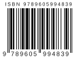

# ISBN / ISMN Barcode Generator for Adobe InDesign

An Adobe InDesign script that draws a print-ready **EAN-13 barcode** for an **ISBN-13** or **ISMN-13** directly on the page: vector bars, outlined text, white background, grouped as one object.

<p align="center">
  
</p>

## Features

- **ISBN-13 and ISMN-13.** Books (978 / 979) and printed music (9790). The type is detected from the code prefix.
- **Validated input.** Length, prefix and check digit are checked before anything is drawn. Errors appear inside the dialog, which stays open until they are fixed.
- **ISBN-10 conversion.** An old ISBN-10 is converted to ISBN-13 with a new check digit, keeping your hyphenation, and shown for confirmation.
- **Hyphenated display.** Hyphens you type appear in the human-readable line above the bars, e.g. `ISBN 978-0-345-24223-5`.
- **GS1 dimensions.** Quiet zones of 11X left and 7X right, guard bars extended by 5X, size limited to the 80–200% range, bar height scaled from the 22.85 mm target.
- **OCR-B digits.** The digits under the bars use OCR-B when it is installed (Arial otherwise), sized by measured height so any font keeps the same visual size.
- **EAN-5 price add-on.** Optional five-digit add-on (e.g. `90000` for "no price"), placed to the right with its own quiet zone.
- **Clean output.** Bars are merged into one compound path and all text is converted to outlines, so no fonts are needed at the printer. Everything is grouped and named after the code in the Layers panel.
- **Safe for your document.** Text ignores document styles, measurement units and ruler settings are restored afterwards, the whole barcode undoes in one step, and Cancel leaves no undo entry.
- **Remembers settings.** Size, height and position are kept between runs. The price add-on is deliberately not remembered.

## Requirements

- Adobe InDesign with ExtendScript support. Developed on InDesign `Version 21.0` (Windows).
- An open document.
- Arial, Helvetica or Myriad Pro. OCR-B is optional but recommended for the digits.

## Installation

1. In InDesign, open **Window → Utilities → Scripts**.
2. In the Scripts panel, right-click **User** and choose **Reveal in Explorer** (Windows) or **Reveal in Finder** (macOS).
3. Copy `ISBN-13 Barcode Generator for Adobe InDesign.js` into that folder.
4. The script appears under **User** immediately. No restart is needed.

On Windows the folder is usually:

```
%APPDATA%\Adobe\InDesign\Version 21.0\en_US\Scripts\Scripts Panel\
```

The version number and language folder depend on your installation.

## Usage

1. Open the document and go to the page for the barcode, usually the back cover. To centre the barcode on an existing frame, select that frame.
2. Double-click the script in the Scripts panel.
3. Enter the code, with or without hyphens (or an ISBN-10), set size and position, and press **OK**.

### Dialog options

| Option | Range | Default |
|---|---|---|
| Bar width | 25.08–62.70 mm (80–200% of nominal) | 30 mm (≈ 96%) |
| Bar height | 40–100% of the full GS1 height | 66% |
| EAN-5 price add-on | empty or 5 digits | empty |
| Position | X / Y of the background's top-left corner on the page, or centred on the selected object | 100 / 150 mm |

Settings are stored in `Folder.userData/ISBN-Barcode/settings.txt` (on Windows `%APPDATA%\ISBN-Barcode\settings.txt`). Delete the file to reset them.

### Output at default settings

| Property | Value |
|---|---|
| Bar width | 30 mm (X = 0.316 mm) |
| Total width with background | 39.5 mm |
| Bar height | 14.4 mm, guard bars +1.6 mm |
| Digits | OCR-B if installed, 1.7 mm tall |
| Colours | Bars: `Black` swatch · Background: `Paper` |

All margins, text sizes and gaps scale with the chosen width.

## Printing tips

- Change the size from the dialog rather than scaling the group, so margins and digits stay correct.
- Keep the bars 100% black. Avoid four-colour or rich black.
- Keep the white background, especially on dark or photographic covers.
- Scan the final proof, including the add-on if present. Many phone apps read only the main barcode.

## Documentation

- [User guide (Greek, PDF)](docs/ISBN-ISMN%20Barcode%20Generator%20-%20Οδηγός.pdf): installation, usage, error messages and printing advice. Source: [`docs/guide.html`](docs/guide.html).
- [`PLAN.md`](PLAN.md): the phased implementation plan, including which GS1 facts were verified and against which sources.
- [`CLAUDE.md`](CLAUDE.md): architecture notes for contributors.

The script's dialog and messages are in Greek.

## Development

The script is ES3 ExtendScript in a single file. The encoding, validation, layout and settings logic are pure functions, tested outside InDesign with Node.js (no dependencies):

```bash
node tests/run.js
```

The tests use fixtures from published references: the Wikipedia EAN-13, ISBN and EAN-5 worked examples, and GS1 nominal dimensions. Drawing still needs a manual check in InDesign, ideally with a barcode scanner.

```
├── ISBN-13 Barcode Generator for Adobe InDesign.js   the script
├── tests/run.js                                      Node test suite
├── docs/                                             user guide (HTML + PDF), sample image
├── PLAN.md                                           implementation plan
└── CLAUDE.md                                         architecture notes
```

## Standards

- GS1 General Specifications: EAN-13 symbol dimensions, quiet zones and add-on separation.
- ISO/IEC 15420: EAN/UPC bar code symbology.
- ISBN and ISMN are assigned by the national ISBN / ISMN agencies. Use the code you were given; the script validates it but cannot check that it was registered.

## Copyright

© 2026 George Hadji. All rights reserved.
